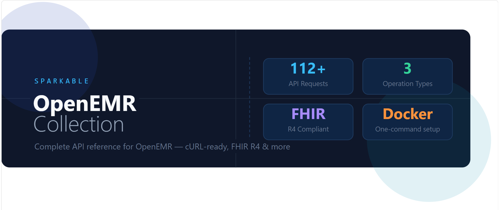

# OpenEMR Collection

> A complete, production-ready API reference and developer toolkit for OpenEMR — covering 121+ documented requests across FHIR R4, Basic Auth & Custom Operations.



---

## 🧭 Overview

**OpenEMR Collection** is an open-source developer resource built by [Sparkable](https://sparkable.dev) to make integrating with OpenEMR fast, reliable, and well-documented.

Whether you're building a healthcare app, connecting an EHR to your platform, or exploring FHIR R4 — this collection gives you everything you need to get started in minutes.

### What's included

- ✅ 121+ documented API requests (cURL-ready)
- ✅ FHIR R4 operations (Patient, Observation, Encounter, and more)
- ✅ Basic operations & OAuth2 authentication flows
- ✅ Custom OpenEMR operations (appointments, medications, billing, etc.)
- ✅ Full documentation site built with Astro Starlight
- ✅ One-command Docker setup for local OpenEMR
- ✅ Live interactive demo
- ✅ MCP integration (see [mcp-healthcare](https://github.com/Sparkable-dev/mcp-healthcare))

---

## 📁 Project Structure

openemr-collection/
├── assets/          # Screenshots, GIFs, and assets for README
├── public/          # Images and logos for the docs site
├── src/             # Astro Starlight docs site (monorepo)
│   ├── components/  # Custom Astro components
│   └── content/
│       └── docs/    # All documentation pages (.md / .mdx)
├── docker/          # Nginx config for iframe/live demo
├── docker-compose.yml
├── package.json
└── astro.config.mjs

---

## 🚀 Getting Started

### Prerequisites

- [Node.js](https://nodejs.org/) v18+
- [Docker](https://www.docker.com/) & Docker Compose
- Git

### Run the Docs Site Locally

```bash
git clone https://github.com/Sparkable-dev/openemr-collection.git
cd openemr-collection
npm install
npm run dev
```

Docs will be available at `http://localhost:4321`

### Run OpenEMR Locally via Docker

```bash
docker compose up -d
```

OpenEMR will be available at `http://localhost:8300`

Default credentials:
- Username: `admin`
- Password: `admin`

> After login, go to **Admin → Globals → Connectors** and enable REST API and FHIR R4 API.

---

## 📖 Documentation

Full documentation is available at **[docs link here]**

| Section | Description |
|---|---|
| Introduction | Project overview, features, and demo video |
| Get Started | Prerequisites, setup, and Insomnia collection import |
| Basic Ops & Auth | Health check, token generation, client registration |
| FHIR R4 Operations | Patient, Encounter, Observation, Medication, and 20+ more |
| Custom Operations | Appointments, billing, messaging, SOAP notes, and more |
| Self Hosting | How to self-host OpenEMR with live demo |
| MCP Integration | Connect to the mcp-healthcare project |
| Managed Services | Hosted OpenEMR by Sparkable |

---

## 🎮 Live Demo

An interactive live demo is available at **[demo link here]**

The demo features a split-screen interface:
- **Left panel** — Browse and run API operations (Basic & Auth, FHIR R4, Custom)
- **Right panel** — Live OpenEMR portal (real-time results)

---

## 🔗 Related Projects

| Project | Description |
|---|---|
| [mcp-healthcare](https://github.com/Sparkable-dev/mcp-healthcare) | MCP server for AI-powered healthcare workflows with OpenEMR / Medplum |

---

## 🏢 Managed Services

Don't want to self-host? **Sparkable** offers fully managed OpenEMR hosting with support, maintenance, and integrations included.

👉 [Learn more](https://sparkable.dev/managed-services)

---

## 🤝 Contributing

Contributions are welcome! Please open an issue or submit a pull request.

---

## 📄 License

This project is open source. See [LICENSE](LICENSE) for details.

---

<p align="center">Built with ❤️ by <a href="https://sparkable.dev">Sparkable</a></p>
